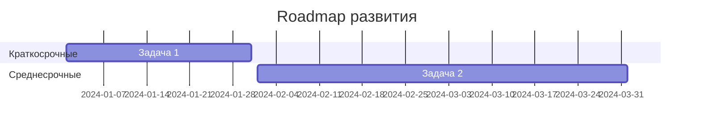

# Инструкция по созданию первоначальной структуры документации для нового подмодуля

## 📋 Назначение

Данная инструкция описывает, как создать первоначальную структуру документации при добавлении нового подмодуля в папку `docs/`. Инструкция содержит шаблоны и правила заполнения базовых файлов документации.

## 🚀 Шаги создания структуры для нового подмодуля

### 1. Создание базовой структуры папок

При добавлении нового подмодуля создайте следующую структуру:

```
docs/[submodule-name]/
├── README.md                    # Главный файл подмодуля
├── CHANGELOG.md                 # История изменений подмодуля
├── overview.md                  # Обзор назначения подмодуля
├── setup.md                     # Инструкции по установке/настройке
├── architecture/
│   ├── README.md               # Архитектурный обзор
│   ├── structure.md            # Структура подмодуля
│   └── decisions.md            # Архитектурные решения
├── api/
│   ├── README.md               # API документация (если есть)
│   └── endpoints.md            # Описание эндпоинтов
├── features/
│   ├── README.md               # Обзор функций
│   └── [feature-name].md       # Документация по функциям
├── guides/
│   ├── quick-start.md          # Быстрый старт
│   ├── user-guide.md           # Руководство пользователя
│   └── developer-guide.md      # Руководство разработчика
├── examples/
│   ├── README.md               # Обзор примеров
│   └── basic-usage.md          # Базовые примеры использования
├── tasks/
│   ├── README.md               # Обзор задач
│   └── [task-name].md          # Конкретные задачи проекта
├── plans/
│   ├── README.md               # Обзор планов
│   └── [plan-name].md          # Планы развития и roadmap
├── ideas/
│   ├── README.md               # Обзор идей
│   └── [idea-name].md          # Идеи и предложения
└── instructions/
    ├── README.md               # Обзор инструкций
    └── [instruction-name].md   # Специфические инструкции подмодуля
```

### 2. Обязательная последовательность создания

1. **Сначала создайте папки** согласно структуре выше
2. **Скопируйте базовые инструкции** в папку `instructions/`:
   - Скопируйте файлы из `knowledge_hub/instructions/`:
     - `documentation_reading_guide.md`
     - `project_documentation_rules.md`
     - `project_analysis_and_documentation.md`
   - Эти файлы обеспечат единый стандарт документирования
3. **Затем создайте основные файлы** в следующем порядке:
   - `README.md` (главный)
   - `overview.md` 
   - `CHANGELOG.md`
   - `setup.md`
4. **После этого заполните файлы в подпапках**

## 📝 Шаблоны для заполнения файлов

### 🔹 README.md (главный файл подмодуля)

```markdown
# [Название подмодуля]

## 📋 О подмодуле

Краткое описание назначения и роли подмодуля в общей системе.

## 🎯 Основное назначение

- Главная функция подмодуля
- Ключевые возможности
- Целевая аудитория

## 📚 Документация

- [Обзор](overview.md) - общее понимание подмодуля
- [Быстрый старт](guides/quick-start.md) - начало работы
- [Установка](setup.md) - инструкции по установке
- [Архитектура](architecture/README.md) - техническая структура
- [API](api/README.md) - документация API (если есть)
- [Примеры](examples/README.md) - практические примеры

## 🎯 Проектная деятельность

- [Задачи](tasks/README.md) - конкретные задачи проекта
- [Планы](plans/README.md) - планы развития и roadmap
- [Идеи](ideas/README.md) - банк идей и предложений
- [Инструкции](instructions/README.md) - специфические инструкции подмодуля

## 🚀 Быстрый старт

Минимальный пример использования:

```bash
# Основные команды для начала работы
```

## 📞 Контакты

- Ответственный: [Имя]
- Документация: [Ссылка на полную документацию]
- Вопросы: [Контакт для вопросов]

## 📝 Лицензия

[Информация о лицензии]
```

### 🔹 overview.md

```markdown
# Обзор подмодуля [Название]

## 🎯 Назначение

Подробное описание того, для чего создан данный подмодуль и какие задачи он решает.

## 🏗️ Место в общей архитектуре

- Как подмодуль связан с другими компонентами
- Какие зависимости имеет
- На какие компоненты влияет

## 🔑 Ключевые возможности

1. **Основная функция 1**
   - Описание функции
   - Примеры использования

2. **Основная функция 2**
   - Описание функции
   - Примеры использования

## 💡 Концепции и принципы

- Основные принципы работы
- Ключевые концепции
- Ограничения и особенности

## 🔄 Жизненный цикл

Описание основных этапов работы с подмодулем:
1. Инициализация
2. Конфигурация
3. Использование
4. Завершение работы

## 🔗 Связанные компоненты

- Список компонентов, с которыми взаимодействует
- Типы взаимодействий
- Зависимости
```

### 🔹 CHANGELOG.md

```markdown
# История изменений [Название подмодуля]

Все значимые изменения в этом подмодуле будут документированы в этом файле.

Формат основан на [Keep a Changelog](https://keepachangelog.com/ru/1.0.0/).

## [Не выпущено]

### Планируется
- Список планируемых изменений

## [1.0.0] - YYYY-MM-DD

### Добавлено
- Первоначальная версия подмодуля
- Базовая функциональность
- Документация

### Изменено
- (Пока нет изменений)

### Исправлено
- (Пока нет исправлений)

### Удалено
- (Пока ничего не удалено)

---

## Типы изменений

- **Добавлено** - для новых функций
- **Изменено** - для изменений в существующей функциональности
- **Устарело** - для функций, которые скоро будут удалены
- **Удалено** - для удаленных функций
- **Исправлено** - для исправлений багов
- **Безопасность** - для исправлений уязвимостей
```

### 🔹 setup.md

```markdown
# Установка и настройка [Название подмодуля]

## 📋 Системные требования

### Минимальные требования:
- ОС: [Список поддерживаемых ОС]
- Память: [Минимальные требования к памяти]
- Процессор: [Требования к процессору]
- Дисковое пространство: [Требования к диску]

### Зависимости:
- [Название зависимости] версия [X.X.X] или выше
- [Другие зависимости]

## 🚀 Быстрая установка

### Шаг 1: Предварительная подготовка

```bash
# Команды подготовки системы
```

### Шаг 2: Установка основных компонентов

```bash
# Команды установки
```

### Шаг 3: Конфигурация

```bash
# Команды настройки
```

### Шаг 4: Проверка установки

```bash
# Команды проверки
```

## ⚙️ Детальная настройка

### Конфигурационные файлы

Основные файлы конфигурации:
- `config.yaml` - основные настройки
- `settings.ini` - дополнительные параметры

### Параметры конфигурации

| Параметр | Тип | По умолчанию | Описание |
|----------|-----|--------------|----------|
| param1   | str | "default"    | Описание параметра |
| param2   | int | 100          | Описание параметра |

### Переменные окружения

| Переменная | Обязательная | Описание |
|------------|--------------|----------|
| VAR_NAME   | Да          | Описание |

## 🔧 Расширенная настройка

### Интеграция с другими системами

Инструкции по интеграции с:
- Системой A
- Системой B

### Настройка безопасности

- Настройка авторизации
- Конфигурация SSL/TLS
- Файрвол и сетевые настройки

## ❌ Решение проблем

### Частые проблемы

**Проблема**: Описание проблемы
**Решение**: Пошаговое решение

**Проблема**: Другая проблема  
**Решение**: Другое решение

### Проверка корректности установки

```bash
# Команды для диагностики
```

## 📞 Поддержка

При возникновении проблем:
1. Проверьте [FAQ](#решение-проблем)
2. Обратитесь к [документации](README.md)
3. Создайте issue в репозитории
```

### 🔹 Шаблоны для подпапок

#### architecture/README.md
```markdown
# Архитектура [Название подмодуля]

## 🏗️ Общая архитектура

Высокоуровневое описание архитектуры подмодуля.

## 📦 Компоненты

### Основные компоненты:
1. **Компонент A** - описание
2. **Компонент B** - описание  
3. **Компонент C** - описание

## 🔄 Взаимодействия

Диаграммы и описания взаимодействий между компонентами.

## 📝 Архитектурные решения

Ссылка на [decisions.md](decisions.md) для детального описания принятых решений.
```

#### guides/quick-start.md
```markdown
# Быстрый старт с [Название подмодуля]

## 🚀 За 5 минут

### Шаг 1: Установка
```bash
# Команды быстрой установки
```

### Шаг 2: Базовая настройка
```bash
# Минимальная настройка
```

### Шаг 3: Первый запуск
```bash
# Команды запуска
```

### Шаг 4: Проверка работы
```bash
# Команды проверки
```

## 🎯 Что дальше?

- [Детальная установка](../setup.md)
- [Руководство пользователя](user-guide.md)
- [Примеры использования](../examples/README.md)
```

#### examples/README.md
```markdown
# Примеры использования [Название подмодуля]

## 📚 Доступные примеры

1. [Базовое использование](basic-usage.md) - простейшие примеры
2. [Продвинутые сценарии](advanced-usage.md) - сложные случаи
3. [Интеграции](integrations.md) - примеры интеграций

## 🎯 Как использовать примеры

1. Скопируйте код примера
2. Адаптируйте под свои нужды
3. Запустите и протестируйте
4. Изучите комментарии в коде

## 💡 Рекомендации

- Начните с базовых примеров
- Изучите архитектуру перед сложными сценариями
- Проверяйте совместимость версий
```

#### tasks/README.md
```markdown
# Задачи проекта [Название подмодуля]

## 📋 О задачах

В этой папке собраны конкретные задачи, связанные с разработкой и поддержкой подмодуля.

## 📁 Структура задач

### По статусу:
- 🔴 **Критические** - требуют немедленного решения
- 🟡 **Важные** - высокий приоритет
- 🟢 **Обычные** - стандартный приоритет
- 🔵 **Низкий приоритет** - когда будет время

### По типу:
- 🐛 **Багфиксы** - исправление ошибок
- ✨ **Новые функции** - добавление возможностей
- 🔧 **Технические задачи** - рефакторинг, оптимизация
- 📚 **Документация** - обновление docs

## 📝 Формат задач

Каждая задача должна содержать:
- **Описание проблемы/цели**
- **Критерии готовности**
- **Этапы выполнения**
- **Ожидаемый результат**

## 🎯 Активные задачи

- [Название задачи 1](task-example.md) - краткое описание
- [Название задачи 2](task-example2.md) - краткое описание

## ✅ Выполненные задачи

Список выполненных задач для истории и ссылок.
```

#### plans/README.md
```markdown
# Планы развития [Название подмодуля]

## 🎯 О планах

Здесь собраны планы развития подмодуля, roadmap и стратегические решения.

## 📅 Структура планирования

### Временные рамки:
- 🚀 **Краткосрочные** (1-3 месяца)
- 📈 **Среднесрочные** (3-6 месяцев)
- 🌟 **Долгосрочные** (6+ месяцев)

### Типы планов:
- 🏗️ **Архитектурные** - изменения в структуре
- ✨ **Функциональные** - новые возможности
- 🔧 **Технические** - улучшения производительности
- 📱 **UX/UI** - улучшения интерфейса

## 📋 Активные планы

### Краткосрочные:
- [План 1](plan-short-term.md) - описание

### Среднесрочные:
- [План 2](plan-medium-term.md) - описание

### Долгосрочные:
- [План 3](plan-long-term.md) - описание

## 📊 Roadmap



## 🔄 Процесс планирования

1. **Анализ текущего состояния**
2. **Определение целей**
3. **Создание плана**
4. **Утверждение и запуск**
5. **Контроль выполнения**
```

#### ideas/README.md
```markdown
# Идеи для [Название подмодуля]

## 💡 О банке идей

Коллекция идей, предложений и концепций для будущего развития подмодуля.

## 🏷️ Категории идей

### По источнику:
- 👥 **От пользователей** - запросы и предложения
- 👨‍💻 **От разработчиков** - технические улучшения
- 📊 **Из аналитики** - на основе данных использования
- 🔬 **Исследования** - новые технологии и подходы

### По типу:
- ✨ **Новые функции** - расширение возможностей
- 🎨 **UX/UI улучшения** - удобство использования
- ⚡ **Производительность** - оптимизации
- 🔗 **Интеграции** - связи с другими системами

## 💭 Активные идеи

### В рассмотрении:
- [Идея 1](idea-feature-name.md) - краткое описание
- [Идея 2](idea-improvement.md) - краткое описание

### Одобренные к реализации:
- [Идея 3](idea-approved.md) - переносится в планы

### Отложенные:
- [Идея 4](idea-postponed.md) - причина отсрочки

## 📝 Как предложить идею

1. **Опишите проблему** или возможность
2. **Предложите решение** или концепцию
3. **Укажите преимущества** и влияние
4. **Оцените сложность** реализации
5. **Добавьте примеры** или референсы

## 🎯 Критерии оценки идей

- **Польза для пользователей** - насколько решает проблемы
- **Техническая реализуемость** - сложность разработки
- **Ресурсы** - время и стоимость
- **Совместимость** - влияние на существующий функционал
- **Стратегическое значение** - соответствие целям проекта
```

#### instructions/README.md
```markdown
# Инструкции для [Название подмодуля]

## 📋 О инструкциях

Коллекция специфических инструкций, гайдов и процедур для работы с подмодулем.

## 🏷️ Типы инструкций

### По назначению:
- 🔧 **Технические** - настройка, конфигурация, развертывание
- 👨‍💻 **Разработка** - coding guidelines, процессы разработки
- 🏗️ **Архитектурные** - проектирование и структура
- 📚 **Документирование** - правила ведения документации
- 🚀 **Деплой** - процедуры развертывания
- 🔍 **Тестирование** - методы и процедуры тестирования

### По аудитории:
- 👤 **Для разработчиков** - техническая команда
- 👥 **Для пользователей** - конечные пользователи
- 🏢 **Для администраторов** - системные администраторы
- 📊 **Для аналитиков** - команда аналитики

## 📚 Доступные инструкции

### Базовые инструкции (скопированы из knowledge_hub):
- [Правила документирования проекта](project_documentation_rules.md) - основные стандарты
- [Анализ и документирование проекта](project_analysis_and_documentation.md) - процедуры анализа
- [Руководство по чтению документации](documentation_reading_guide.md) - навигация по docs
- [Создание структуры документации](documentation_start_structure_guide.md) - данное руководство

### Разработка:
- [Настройка среды разработки](dev-environment-setup.md)
- [Coding Guidelines](coding-guidelines.md)
- [Git Workflow](git-workflow.md)
- [Code Review процесс](code-review-process.md)

### Развертывание:
- [Деплой в production](production-deploy.md)
- [Настройка CI/CD](cicd-setup.md)
- [Monitoring и логирование](monitoring-setup.md)

### Архитектура:
- [Добавление новых модулей](add-new-module.md)
- [Интеграция с внешними системами](external-integrations.md)
- [Миграция данных](data-migration.md)

### Документация:
- [Правила документирования](documentation-rules.md)
- [Шаблоны документов](document-templates.md)

## 📝 Структура инструкции

Каждая инструкция должна содержать:

### 🎯 Заголовок и цель
- Четкое название инструкции
- Кому предназначена
- Какую проблему решает

### 📋 Предварительные требования
- Необходимые знания
- Требуемые инструменты
- Зависимости

### 🔧 Пошаговое выполнение
- Нумерованные шаги
- Команды и код
- Скриншоты (если нужны)

### ✅ Проверка результата
- Как проверить успешность
- Возможные ошибки
- Устранение проблем

### 🔗 Связанные ресурсы
- Ссылки на документацию
- Полезные инструменты
- Дополнительная информация

## 🚨 Важные принципы

### Качество инструкций:
- **Актуальность** - регулярное обновление
- **Полнота** - все необходимые детали
- **Ясность** - понятные формулировки
- **Проверяемость** - можно следовать пошагово

### Стандарты оформления:
- Используйте единую структуру
- Добавляйте эмодзи для категоризации
- Включайте примеры команд
- Предусматривайте troubleshooting

## 🔄 Процесс обновления

1. **Регулярный аудит** - проверка актуальности
2. **Обратная связь** - отзывы пользователей
3. **Версионирование** - отслеживание изменений
4. **Тестирование** - проверка работоспособности

## 💡 Рекомендации

- **Начинайте с простого** - базовые сценарии сначала
- **Добавляйте контекст** - объясняйте "почему", не только "как"
- **Используйте примеры** - реальные случаи использования
- **Предусматривайте ошибки** - типичные проблемы и решения
```

## 🎯 Принципы заполнения

### 📝 Общие правила:

1. **Замените все заглушки** вида `[Название подмодуля]` на реальные названия
2. **Заполните все секции** минимальным содержимым
3. **Используйте единый стиль** оформления
4. **Добавляйте эмодзи** для категоризации разделов
5. **Создавайте внутренние ссылки** между документами

### 🔗 Связность документации:

- Каждый файл должен ссылаться на связанные документы
- README.md является навигационным центром
- Все документы должны быть доступны через навигацию
- Используйте относительные пути для ссылок

### ⚡ Приоритет заполнения:

1. **Высокий приоритет**: README.md, overview.md, quick-start.md
2. **Средний приоритет**: setup.md, CHANGELOG.md, basic-usage.md, tasks/README.md
3. **Низкий приоритет**: architecture/, api/ (если не нужны), plans/, ideas/, instructions/

## ✅ Чек-лист создания структуры

### Основная структура:
- [ ] Создана папочная структура
- [ ] Скопированы базовые файлы из knowledge_hub/instructions/ в папку instructions/
- [ ] Заполнен главный README.md
- [ ] Написан overview.md
- [ ] Создан CHANGELOG.md с первой записью
- [ ] Заполнен setup.md
- [ ] Создан guides/quick-start.md
- [ ] Добавлен examples/basic-usage.md

### Проектная деятельность:
- [ ] Создана папка tasks/ с README.md
- [ ] Создана папка plans/ с README.md
- [ ] Создана папка ideas/ с README.md
- [ ] Создана папка instructions/ с README.md
- [ ] Добавлены ссылки на новые папки в главный README.md

### Финальная проверка:
- [ ] Проверены все внутренние ссылки
- [ ] Добавлена навигация между документами
- [ ] Все папки содержат README.md файлы

## 🚨 Важные замечания

⚠️ **НЕ ЗАПОЛНЯЙТЕ СТРУКТУРУ** - эта инструкция только для понимания того, как правильно создать и организовать документацию нового подмодуля.

📋 **ОБЯЗАТЕЛЬНО СКОПИРУЙТЕ БАЗОВЫЕ ФАЙЛЫ** - всегда копируйте стандартные инструкции из `knowledge_hub/instructions/` для обеспечения единого стандарта документирования во всех проектах.

✅ **СОЗДАВАЙТЕ ПОСТЕПЕННО** - начните с основных файлов, затем добавляйте детали.

🎯 **ПОДДЕРЖИВАЙТЕ АКТУАЛЬНОСТЬ** - регулярно обновляйте документацию при изменениях в коде.

---

**Цель**: Эта инструкция поможет быстро и правильно создать полную структуру документации для любого нового подмодуля в проекте.
