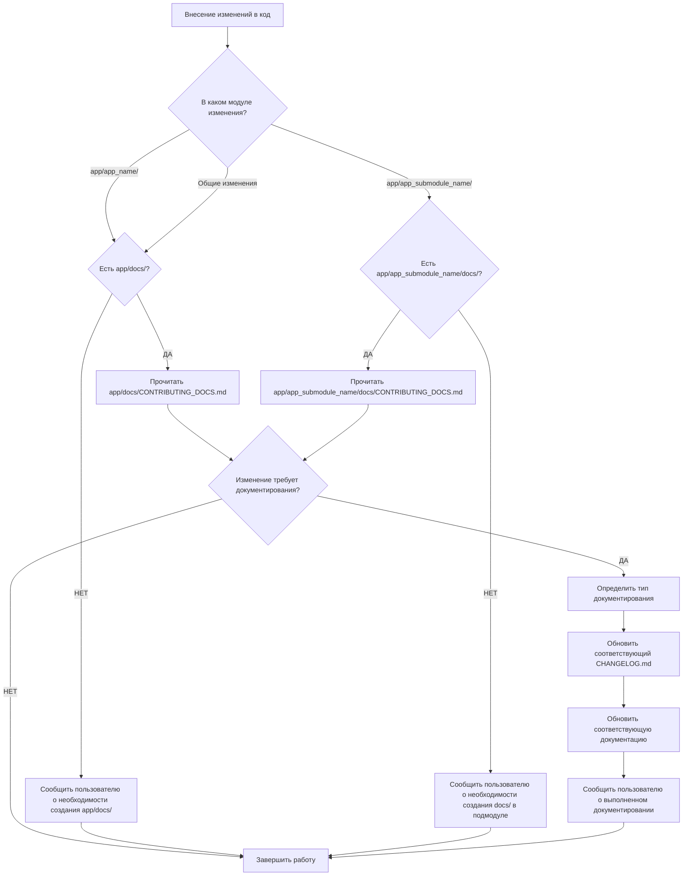

# Правила работы с документацией отдельного проекта

## 📋 Назначение

Данная инструкция описывает правила работы с документацией **отдельного проекта**. Применяется к любому проекту, который имеет папку `docs/` и следует стандартам автоматического документирования. Эта инструкция НЕ для knowledge_hub (центрального хранилища), а для работы с конкретными проектами.

## 🏗️ Специфическая структура проектов пользователя

### Основная структура проекта:

```
project/                    # Корень проекта
├── app/                    # Репозиторий (основная папка с кодом)
│   ├── app_name/           # Главное приложение проекта
│   │   ├── models.py       # Django модели
│   │   ├── views.py        # Django представления
│   │   ├── urls.py         # URL маршруты
│   │   ├── admin.py        # Django админка
│   │   ├── serializers.py  # DRF сериализаторы
│   │   └── ...             # Другие файлы приложения
│   ├── app_submodule_name/ # Приложение-подмодуль
│   │   ├── docs/           # 📚 ДОКУМЕНТАЦИЯ ПОДМОДУЛЯ
│   │   │   ├── README.md   # Главный файл документации подмодуля
│   │   │   ├── CHANGELOG.md # История изменений подмодуля
│   │   │   ├── CONTRIBUTING_DOCS.md # Правила документирования (ВАЖНО!)
│   │   │   ├── overview.md # Обзор назначения подмодуля
│   │   │   ├── setup.md    # Инструкции по установке/настройке
│   │   │   ├── architecture/ # Архитектурные детали
│   │   │   ├── features/   # Описание ключевых модулей
│   │   │   ├── api/        # API документация
│   │   │   ├── db/         # Схемы БД и миграции
│   │   │   ├── guides/     # Руководства пользователя
│   │   │   ├── examples/   # Примеры использования
│   │   │   └── cheatsheet.md # Шпаргалки по подмодулю
│   │   ├── submodules/     # Вспомогательные подмодули
│   │   ├── models.py       # Модели подмодуля
│   │   ├── views.py        # Представления подмодуля
│   │   └── ...             # Другие файлы подмодуля
│   ├── docs/               # 📚 ДОКУМЕНТАЦИЯ ВСЕГО ПРОЕКТА
│   │   ├── README.md       # Главный файл документации проекта
│   │   ├── CHANGELOG.md    # История изменений проекта
│   │   ├── CONTRIBUTING_DOCS.md # Правила документирования (КРИТИЧЕСКИ ВАЖНО!)
│   │   ├── overview.md     # Обзор назначения проекта
│   │   ├── setup.md        # Инструкции по установке проекта
│   │   ├── architecture/   # Общая архитектура проекта
│   │   ├── features/       # Описание модулей проекта
│   │   ├── api/            # API документация проекта
│   │   ├── db/             # Общие схемы БД и миграции
│   │   ├── guides/         # Руководства пользователя
│   │   ├── examples/       # Примеры использования
│   │   └── cheatsheet.md   # Шпаргалки по проекту
│   ├── manage.py           # Django management команды
│   ├── settings.py         # Настройки Django
│   ├── urls.py             # Основные URL маршруты
│   └── ...                 # Другие файлы проекта
├── env/                    # Виртуальное окружение
├── requirements.txt        # Зависимости проекта
└── README.md               # Основной README проекта
```

### 📍 Важные особенности структуры:

1. **🎯 Многоуровневая документация**:
   - `app/docs/` - документация **всего проекта**
   - `app/app_submodule_name/docs/` - документация **конкретного подмодуля**

2. **🔄 Правила применения документирования**:
   - При изменениях в **главном приложении** (`app_name/`) → обновляется `app/docs/`
   - При изменениях в **подмодуле** (`app_submodule_name/`) → обновляется `app/app_submodule_name/docs/`
   - При **общих изменениях проекта** → обновляется `app/docs/`

3. **🚨 КРИТИЧЕСКОЕ ПРАВИЛО**: 
   - **Если изменения выполнены в подмодуле** → документирование ОБЯЗАТЕЛЬНО в документации **этого подмодуля** (`app/app_submodule_name/docs/`)
   - **Если изменения касаются основного проекта** → документирование ОБЯЗАТЕЛЬНО в **основной документации** (`app/docs/`)
   - **Принцип**: Каждое изменение документируется на том уровне, где оно было сделано

4. **🔗 ПРИНЦИП ИЗБЕЖАНИЯ ДУБЛИРОВАНИЯ**:
   - **Используйте относительные ссылки** между документацией разных уровней
   - **НЕ ДУБЛИРУЙТЕ** общую информацию - ссылайтесь на неё
   - **Подмодули могут ссылаться** на общую документацию проекта
   - **Общая документация может ссылаться** на детали в подмодулях
   - **Пример**: `app/app_submodule_name/docs/setup.md` может ссылаться на `../../docs/setup.md#общие-требования`

5. **📂 Django-специфика**:
   - `app/` содержит `manage.py` (корень Django проекта)
   - `env/` - виртуальное окружение отдельно от кода
   - Типичная Django структура с приложениями

## 🚨 Критические правила автоматического документирования

### Обязательные действия после КАЖДОГО изменения в коде:

1. **🔍 Определить уровень изменения и соответствующую документацию**:
   - Изменения в `app/app_name/` (основное приложение) → работаем с `app/docs/`
   - Изменения в `app/app_submodule_name/` (подмодуль) → работаем с `app/app_submodule_name/docs/`
   - Общие изменения проекта (settings.py, requirements.txt, etc.) → работаем с `app/docs/`

2. **🚨 СТРОГО СОБЛЮДАТЬ ПРАВИЛО**: 
   - **Изменения в подмодуле** = документирование ТОЛЬКО в `app/подмодуль/docs/`
   - **Изменения в основном проекте** = документирование ТОЛЬКО в `app/docs/`
   - **НЕ СМЕШИВАТЬ** уровни документирования

3. **📖 Проверить наличие соответствующей папки docs/**:
   - Если нужная docs/ СУЩЕСТВУЕТ → переходим к шагу 4
   - Если нужная docs/ НЕТ → ОБЯЗАТЕЛЬНО сообщить пользователю

4. **📋 Прочитать правила документирования**:
   - Найти файл `CONTRIBUTING_DOCS.md` в ПРАВИЛЬНОЙ папке docs/
   - Изучить специфические правила для данного уровня (проект/подмодуль)
   - Следовать чек-листу из СООТВЕТСТВУЮЩЕГО файла

5. **🎯 Определить тип изменения** согласно правилам:
   - ✅ **Требует обязательного документирования**
   - ⚠️ **Желательно документировать**  
   - ❌ **Не требует документирования**

6. **📝 Выполнить документирование** (если требуется):
   - Обновить ПРАВИЛЬНЫЙ CHANGELOG.md (тот, который соответствует уровню изменений)
   - Создать/обновить документацию в СООТВЕТСТВУЮЩЕЙ папке docs/
   - Обновить API документацию на ПРАВИЛЬНОМ уровне
   - Обновить документацию БД в НУЖНОЙ папке docs/db/

## ✅ Когда ОБЯЗАТЕЛЬНО обновлять документацию

### Для Django проектов:
- ✅ Новые модели Django в любом приложении
- ✅ Новые API эндпоинты в любом приложении
- ✅ Изменения в существующих API
- ✅ Новые Django приложения/подмодули
- ✅ Изменения в admin.py (новые админки)
- ✅ Новые функции в views.py
- ✅ Изменения в settings.py (ТОЛЬКО с разрешения пользователя)
- ✅ Исправления критических багов
- ✅ Новые сериализаторы DRF
- ✅ Изменения в URL маршрутах (urls.py)

### Для подмодулей:
- ✅ Новые модели в подмодуле → обновить `app/app_submodule_name/docs/`
- ✅ Новые view функции в подмодуле → обновить документацию подмодуля
- ✅ API изменения в подмодуле → обновить API docs подмодуля
- ✅ Архитектурные изменения в подмодуле → обновить architecture/ подмодуля

### Для общего проекта:
- ✅ Изменения в настройках проекта → обновить `app/docs/`
- ✅ Новые зависимости в requirements.txt → обновить setup.md
- ✅ Изменения в manage.py или корневых конфигах → обновить общую документацию

## ⚠️ Желательно документировать

- ⚠️ Рефакторинг с изменением логики в любом модуле
- ⚠️ Оптимизации производительности
- ⚠️ Улучшения UI/UX
- ⚠️ Незначительные багфиксы в подмодулях

## ❌ Не требует документирования

- ❌ Исправления опечаток
- ❌ Форматирование кода без изменения логики
- ❌ Обновления комментариев
- ❌ Linting и тестирование (служебные операции)

## 📝 Стандартные шаблоны для документирования

### CHANGELOG.md - формат записи (применяется к любому уровню):

```markdown
## [Версия] - $(date +%Y-%m-%d)

### Добавлено
- **[Название модуля/функции]:**
  - Краткое описание добавленного функционала
  - Технические детали (если важны)
  - Примеры использования (для API)

### Изменено  
- **[Что изменено]:** описание изменений и их влияние на пользователей

### Исправлено
- **[Проблема]:** краткое описание проблемы
- **[Решение]:** как проблема была решена

### Технические улучшения
- Описание внутренних улучшений и оптимизаций
```

### Документация нового модуля/подмодуля:

```markdown
# Модуль [Название]

## 📋 Назначение
Краткое описание назначения модуля в контексте проекта

## 🛠 Основной функционал
- Ключевая функция 1
- Ключевая функция 2

## 🏗 Архитектура
Описание архитектурных решений и связей с другими модулями

## 🔌 Интеграции
Связи с другими модулями/подмодулями проекта

## 📖 Примеры использования
Практические примеры кода с учетом Django специфики
```

## 🔄 Алгоритм действий для разработчика/агента



## 📚 Ключевые файлы документации проекта

### Обязательные файлы для общего проекта (`app/docs/`):

1. **📖 app/docs/README.md** - главная точка входа в документацию проекта
   - Обзор всего проекта и его назначения
   - Навигация по всей документации проекта
   - Ссылки на документацию подмодулей

2. **📋 app/docs/CHANGELOG.md** - история всех изменений проекта
   - Изменения на уровне всего проекта
   - Крупные изменения в подмодулях
   - Общие архитектурные решения

3. **⚙️ app/docs/CONTRIBUTING_DOCS.md** - правила документирования проекта
   - **КРИТИЧЕСКИ ВАЖНЫЙ ФАЙЛ** для агента
   - Специфические правила проекта по документированию
   - Чек-лист действий при изменениях в любом модуле

### Обязательные файлы для подмодуля (`app/app_submodule_name/docs/`):

1. **📖 app/app_submodule_name/docs/README.md** - документация подмодуля
   - Обзор подмодуля и его роли в проекте
   - Навигация по документации подмодуля
   - Связи с другими подмодулями

2. **📋 app/app_submodule_name/docs/CHANGELOG.md** - история изменений подмодуля
   - Изменения только в этом подмодуле
   - Детальная история развития подмодуля

3. **⚙️ app/app_submodule_name/docs/CONTRIBUTING_DOCS.md** - правила документирования подмодуля
   - Специфические правила подмодуля
   - Может отличаться от общих правил проекта

### Принципы связности и избежания дублирования:

- **📖 README.md как точка входа** - каждый docs/README.md является навигационным центром для своего уровня
- **🔗 Относительные ссылки между уровнями** - активно используйте ссылки между документацией проекта и подмодулей
- **📂 Иерархическая структура** - максимум 2-3 уровня вложенности для удобства
- **📝 Понятные имена файлов** - setup.md лучше чем inst.md, quick-start.md лучше чем qs.md

### Примеры относительных ссылок:

#### Из документации подмодуля на общую документацию:
```markdown
<!-- В app/app_submodule_name/docs/setup.md -->
Общие системные требования см. в [основной документации](../../docs/setup.md#системные-требования)

Архитектура всего проекта описана в [общей документации](../../docs/architecture/README.md)
```

#### Из общей документации на подмодули:
```markdown
<!-- В app/docs/overview.md -->
Детали модуля аутентификации см. в [документации auth модуля](../auth_module/docs/README.md)

API эндпоинты платежей описаны в [документации payments](../payments/docs/api/README.md)
```

#### Между подмодулями:
```markdown
<!-- В app/module_a/docs/integration.md -->
Интеграция с модулем B описана в [документации module_b](../../module_b/docs/integration.md#с-модулем-a)
```

### Правила использования ссылок:

1. **🚫 НЕ ДУБЛИРУЙТЕ** общую информацию - всегда ссылайтесь на первоисточник
2. **🔗 ССЫЛАЙТЕСЬ** на детали в других уровнях документации
3. **📍 ИСПОЛЬЗУЙТЕ ЯКОРЯ** для ссылок на конкретные разделы (`#раздел`)
4. **🎯 ЧЕТКО УКАЗЫВАЙТЕ** куда ведет ссылка в тексте
5. **✅ ПРОВЕРЯЙТЕ** работоспособность относительных ссылок при изменениях структуры

## 🎯 Специальные требования для Django проектов

### Импорты и архитектура:
```python
# ✅ ПРАВИЛЬНО - через get_user_model()
from django.contrib.auth import get_user_model
User = get_user_model()

# ❌ НЕПРАВИЛЬНО - прямой импорт
from django.contrib.auth.models import User
```

### Структура Django проекта (адаптировано под пользователя):
```
project/
├── app/              # Корневая папка Django (manage.py здесь)
│   ├── app_name/     # Главное приложение
│   ├── app_submodule_name/ # Подмодули-приложения
│   └── docs/         # Документация проекта
├── env/              # Виртуальное окружение  
└── ...               # Прочие файлы
```

### Правила для settings.py:
- 🚨 **КРИТИЧЕСКИ ВАЖНО**: Изменения в `app/settings.py` ТОЛЬКО после явного разрешения пользователя
- Всегда спрашивать разрешение перед внесением изменений
- Документировать все изменения в `app/docs/CHANGELOG.md`

### Миграции Django:
- Не создавать миграции автоматически
- Пользователь сам управляет миграциями
- Только предлагать создание миграций
- Документировать изменения моделей в соответствующих docs/db/

### Принцип минимализма:
- Добавлять только необходимые поля в модели
- Избегать избыточных или лишних полей
- Придерживаться принципа YAGNI (You Aren't Gonna Need It)

## 🚨 Критические проверки перед завершением работы

### НИКОГДА не завершайте работу без:
- [ ] Определения уровня изменений (проект/подмодуль)
- [ ] Проверки наличия соответствующей папки docs/
- [ ] Чтения правил документирования (CONTRIBUTING_DOCS.md)
- [ ] Проверки необходимости обновления документации  
- [ ] Обновления соответствующих файлов (если необходимо)
- [ ] Уведомления пользователя о состоянии документации

### Контрольные вопросы:
- "В каком ИМЕННО модуле/подмодуле были изменения?"
- "Есть ли СООТВЕТСТВУЮЩАЯ папка docs/ для этого уровня?"
- "Прочитал ли я правила документирования для ЭТОГО КОНКРЕТНОГО уровня?"
- "Нужно ли документировать это изменение согласно правилам ДАННОГО уровня?"
- "Обновил ли я ПРАВИЛЬНЫЙ CHANGELOG.md (тот, который соответствует уровню изменений)?"
- "Документировал ли я изменения на ТОМ ЖЕ УРОВНЕ, где они были сделаны?"
- "НЕ СМЕШАЛ ли я документирование разных уровней?"
- "Уведомил ли я пользователя о документировании с указанием КОНКРЕТНОГО уровня?"

## 📝 Шаблоны завершения работы

### ✅ Если документация существует и обновлена:
```
✅ Изменения внесены в [указать модуль/подмодуль]
📖 Прочитаны правила документирования из [путь к CONTRIBUTING_DOCS.md]
📝 Документация обновлена:
   - [путь к CHANGELOG.md]
   - [путь к соответствующей документации модуля]
   - [дополнительные файлы, если обновлялись]
🎯 Проект готов к использованию
```

### ⚠️ Если документирование не требовалось:
```
✅ Изменения внесены в [указать модуль/подмодуль]
📖 Прочитаны правила документирования - обновление не требуется
💡 Изменения были классифицированы как не требующие документирования
🎯 Проект готов к использованию
```

### 🚨 Если отсутствует папка docs/:

#### Для общего проекта:
```
✅ Изменения внесены в проект
⚠️ В проекте отсутствует папка документации app/docs/!
💡 Рекомендую создать базовую структуру документации проекта:
   📁 app/docs/
   ├── README.md (главный файл документации проекта)
   ├── CHANGELOG.md (история изменений проекта)
   ├── CONTRIBUTING_DOCS.md (правила документирования)
   ├── setup.md (инструкции по установке)
   └── overview.md (обзор проекта)
🎯 Проект готов к использованию (но рекомендуется добавить документацию)
```

#### Для подмодуля:
```
✅ Изменения внесены в подмодуль [название]
⚠️ В подмодуле отсутствует папка документации app/[подмодуль]/docs/!
💡 Рекомендую создать базовую структуру документации подмодуля:
   📁 app/[подмодуль]/docs/
   ├── README.md (документация подмодуля)
   ├── CHANGELOG.md (история изменений подмодуля)
   ├── CONTRIBUTING_DOCS.md (правила документирования подмодуля)
   └── overview.md (обзор подмодуля)
🎯 Проект готов к использованию (но рекомендуется добавить документацию подмодуля)
```

## 🛠️ Инструменты и автоматизация для проекта

### Рекомендуемые инструменты:
- **Автогенерация TOC** - скрипты для создания оглавлений в больших документах
- **Проверка ссылок** - валидация внутренних ссылок между документацией проекта и подмодулей
- **Линтеры документации** - проверка стиля и структуры Markdown файлов
- **Автоматическая генерация API docs** - из Django моделей и DRF сериализаторов

### Интеграция с процессом разработки:
- **Pre-commit hooks** - проверка обновления соответствующего CHANGELOG.md при изменениях
- **CI/CD интеграция** - автоматическая проверка полноты документации на всех уровнях
- **Pull Request templates** - напоминание о необходимости документирования с указанием уровня
- **Версионирование** - синхронизация версий кода и документации проекта/подмодулей

## 🎯 Лучшие практики

### Качество документации:
1. **Актуальность** - регулярное обновление при изменениях на любом уровне
2. **Полнота** - все необходимые детали для понимания модуля/подмодуля
3. **Ясность** - понятные формулировки без избыточного технического жаргона
4. **Примеры** - практические случаи использования с учетом Django специфики
5. **Связность** - логические связи между документацией разных уровней

### Стиль написания:
- **Русский язык** - все документы и комментарии на русском
- **Структурированность** - используйте заголовки и списки
- **Эмодзи для категоризации** - улучшают читаемость и навигацию
- **Краткость** - избегайте избыточного текста, особенно в документации подмодулей

### Поддержка и обновления:
- **Регулярный аудит** - проверка актуальности документации на всех уровнях
- **Обратная связь** - учет отзывов пользователей по документации  
- **Версионирование** - отслеживание изменений в документах проекта и подмодулей
- **Тестирование** - проверка работоспособности инструкций для каждого уровня

## 📞 Поддержка и развитие

### При возникновении вопросов:
1. Определите уровень вопроса (общий проект или конкретный подмодуль)
2. Проверьте документацию в соответствующей папке docs/
3. Изучите примеры в docs/examples/ на нужном уровне
4. Обратитесь к соответствующему CONTRIBUTING_DOCS.md
5. Проверьте cheatsheet.md для быстрых решений
6. Создайте issue в репозитории проекта или обратитесь к команде

### Предложения по улучшению документации:
- Добавляйте отзывы о неполноте или неточности в документации любого уровня
- Предлагайте новые разделы или примеры для проекта или подмодулей
- Обновляйте инструкции на основе реального опыта использования
- Следите за актуальностью ссылок между документацией разных уровней
- Поддерживайте консистентность между документацией проекта и подмодулей

---

**🎯 Цель этой инструкции**: Обеспечить единый стандарт документирования для отдельных проектов со специфической многоуровневой структурой и автоматизировать процесс поддержания актуальной документации на всех уровнях без необходимости постоянных напоминаний разработчикам.

**📝 Область применения**: Проекты со структурой app/docs/ и app/подмодули/docs/ (НЕ для knowledge_hub как центрального хранилища)

**📅 Версия**: 1.2  
**🔄 Последнее обновление**: $(date +%Y-%m-%d)  
**✍️ Автор**: AI Assistant (адаптировано под специфическую структуру пользователя)
